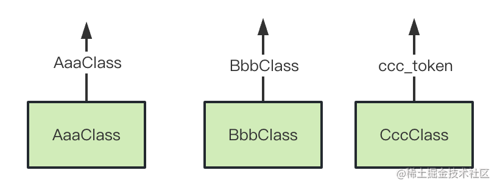
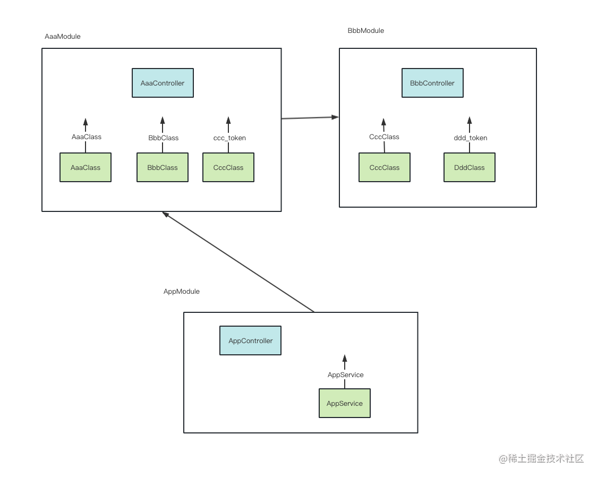

前面讲了 IOC、AOP、全局模块、动态模块、自定义 provider、生命周期等概念，比较零散，这节我们画图来整体串一串。

首先，provider 是可以注入的对象，它们都有 token，比如 @Injectable 装饰器声明的 class

token 可以是 class 也可以是 string：

provider 可以是 useClass 指定 class，也可以 useValue 指定值，或者 useFactory 动态创建。

provider 之间可以相互注入，还可以注入到 controller 里。

provider、controller 放在一个个 Module 里：

module 里 exports 的 provider 在模块被 imports 之后就可以用于别的模块的注入了。

或者可以通过 @Global 把这个模块声明为全局的，那样 Module 内的 provider 就可以在各处注入了。

Provider 可以通过 useFactory 动态创建，Module 也是，可以通过 register、forRoot、forFeature 等方法来动态创建。

在 main.ts 里调用 NestFactory.create 方法，就会从 AppModule 开始递归解析 Module，实例化其中的 provider、controller，并依次调用它们的 onModuleInit 生命周期方法。

之后会再递归调用每个 Module 的 provider、controller 的还有 Module 自身的 onApplicationBootstrap 生命周期方法。

这样 Nest 就能对外提供服务了。

再就是 Nest 从接收到请求，到返回响应的这个流程，有很多切面。

路由最终是在 cotnroller 的方法，也就是 handler 里处理的。

在这个过程中，会经历很多层切面：

首先，请求会被 middleware 处理，这一层可以复用 express 的中间件生态，实现 session、static files 等功能。

这个 middleware 也可以是 Nest 的那种 class 的 middleware，可以注入 provider。

然后在具体的路由会经历 Guard 的处理，它可以通过 ExecutionContext 拿到目标 class、handler 的metadata 等信息，可以实现权限验证等功能。

之后是 Interceptor 可以在请求前后做一些处理，它也可以通过 ExecutionContext 拿到 class、handler 的信息。

在到达 handler 之前，还会对参数用 Pipe 做下检验和转换。

这个过程中不管是哪一层抛的异常，都会被 Exception Filter 处理下，返回给用户友好的响应信息。

这就是整个请求到响应的流程。

通过 AOP 的切面，可以把通用逻辑封装起来，在各处复用。

之后，Nest 销毁的时候，也会依次调用 Module 的 provider、controller 还有 Module 自己的 onModuleDestroy 方法、beforeApplicationShutdown 还有 onApplicationShutdown 的生命周期方法。

后两者的区别是 beforeApplication 可以拿到终止信号。

这就是 Nest 从创建、启动，到处理请求返回响应，再就是销毁的整个流程。

通过 IOC 实现了对象的自动创建、依赖的自动组装。

通过 AOP 实现了通用逻辑的抽取和复用。

IOC 内部的 Module 和 Provider 也都支持动态创建，灵活度很高。

## 总结

我们通过图解串了一下 Module、Provider、Controller、动态模块、全局模块、自定义 Provider、生命周期、Middleware、Guard、Pipe、Interceptor、Exception Filter 等概念。

对 IOC、AOP 也有了更加清晰的认识。

把这些核心概念理解了，对 Nest 就算有比较好的掌握了。
