这节我们继续来学习 TypeORM 的一对多关系的映射和 CRUD。

我们再创建个 typeorm 项目：

    npx typeorm@latest init --name typeorm-relation-mapping2 --database mysql


进入项目目录，安装驱动包 mysql2：

    npm install mysql2

然后修改 data-source.ts 的配置：

```javascript
import "reflect-metadata"
import { DataSource } from "typeorm"
import { User } from "./entity/User"

export const AppDataSource = new DataSource({
    type: "mysql",
    host: "localhost",
    port: 3306,
    username: "root",
    password: "guang",
    database: "typeorm_test",
    synchronize: true,
    logging: true,
    entities: [User],
    migrations: [],
    subscribers: [],
    poolSize: 10,
    connectorPackage: 'mysql2',
    extra: {
        authPlugin: 'sha256_password',
    }
})
```

这些前面讲过，就不解释了。

这次我们创建 Department 和 Employee 两个实体：

    npx typeorm entity:create src/entity/Department
    npx typeorm entity:create src/entity/Employee


然后添加 Department 和 Employee 的映射信息：

```javascript
import { Column, Entity, PrimaryGeneratedColumn } from "typeorm"

@Entity()
export class Department {

    @PrimaryGeneratedColumn()
    id: number;

    @Column({
        length: 50
    })
    name: string;
}
```

```javascript
import { Column, Entity, PrimaryGeneratedColumn } from "typeorm"

@Entity()
export class Employee {
    @PrimaryGeneratedColumn()
    id: number;

    @Column({
        length: 50
    })
    name: string;
}

```

把这俩 Entity 添加到 DataSource 的 entities 里：

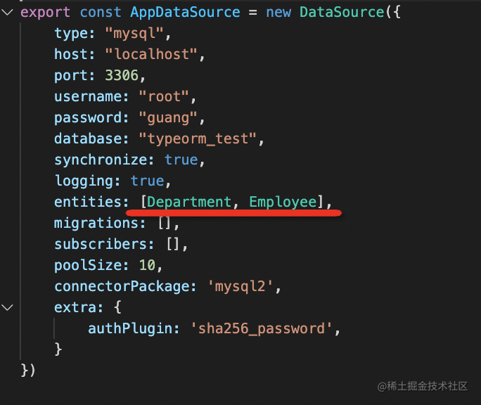

因为 index.ts 里用到了 User，我们用不到，把这些代码删掉：

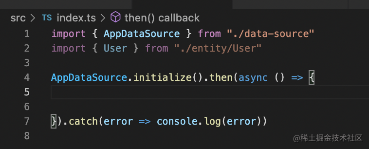

然后 npm run start：


可以看到，这两个表都创建成功了。

如何给它们添加一对多的映射呢？

通过 @ManyToOne 的装饰器：

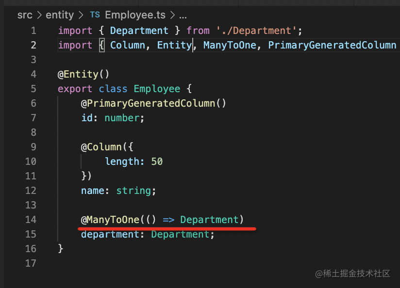

在多的一方使用 @ManyToOne 装饰器。

把这两个表删掉：

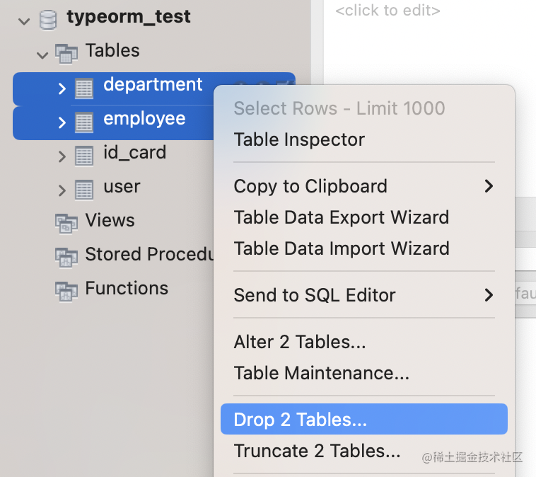

重新 npm run start：


就可以看到创建了两个表，并且在 employee 表添加了外建约束。

workbench 里也可以看到这个外键：

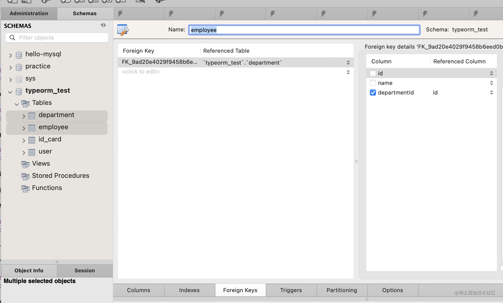

改下 index.ts，新增一些数据，调用 save 保存：

```javascript
import { Department } from './entity/Department';
import { Employee } from './entity/Employee';
import { AppDataSource } from "./data-source"

AppDataSource.initialize().then(async () => {

    const d1 = new Department();
    d1.name = '技术部';

    const e1 = new Employee();
    e1.name = '张三';
    e1.department = d1;

    const e2 = new Employee();
    e2.name = '李四';
    e2.department = d1;

    const e3 = new Employee();
    e3.name = '王五';
    e3.department = d1;

    await AppDataSource.manager.save(Department, d1);
    await AppDataSource.manager.save(Employee,[e1, e2, e3]);


}).catch(error => console.log(error))

```

再跑下：


可以看到被 transaction 包裹的 4 条 insert 语句，分别插入了 Department 和 3 个 Employee。

当然，如果是设置了 cascade，那就只需要保存 empolyee 就好了：

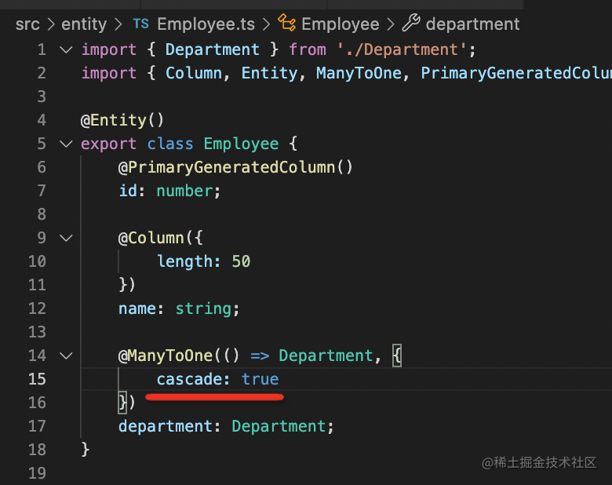

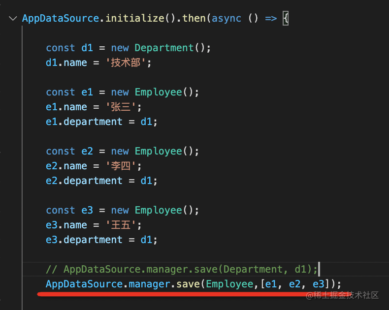

department 会自动级联保存。

不过一对多关系更多还是在一的那一方来保持关系，我们改下 Department：

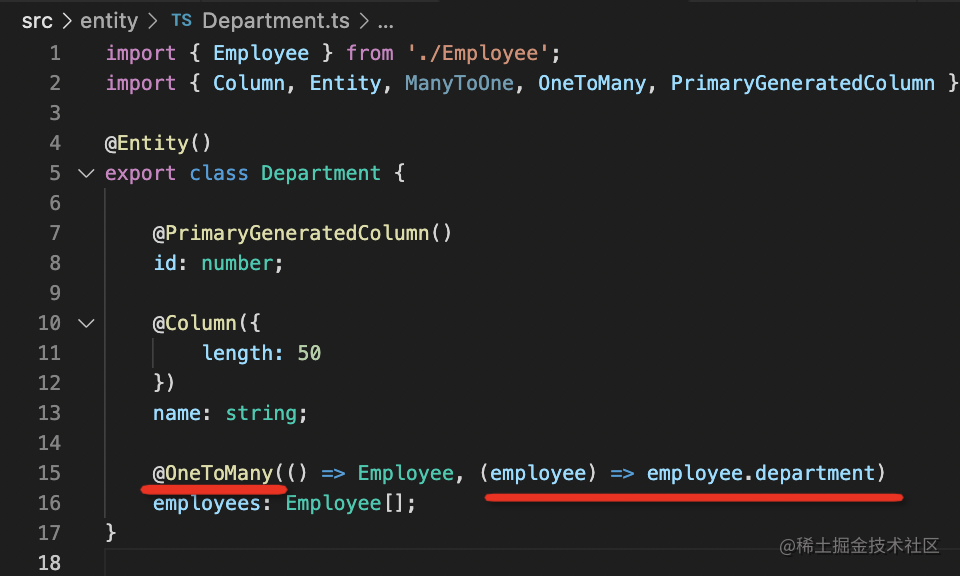

这里要通过第二个参数指定外键列在 employee.department 维护。

一对一的时候我们还通过 @JoinColumn 来指定外键列，为什么一对多就不需要了呢？

因为一对多的关系只可能是在多的那一方保存外键呀！

所以并不需要 @JoinColumn。

不过你也可以通过 @JoinColumn 来修改外键列的名字：


加上 @OneToMany 装饰器，再设置下 cascade：

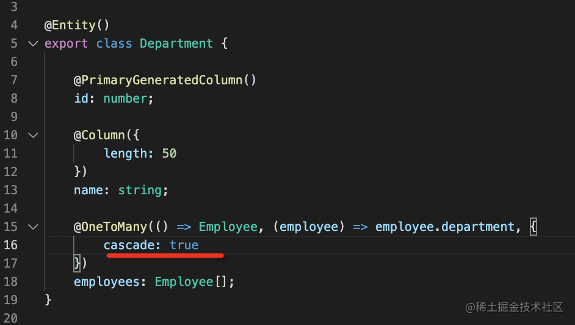

这样当你保存 department 的时候，关联的 employee 也都会保存了。

不过这时候要把 @ManyToOne 的 cascade 去掉。

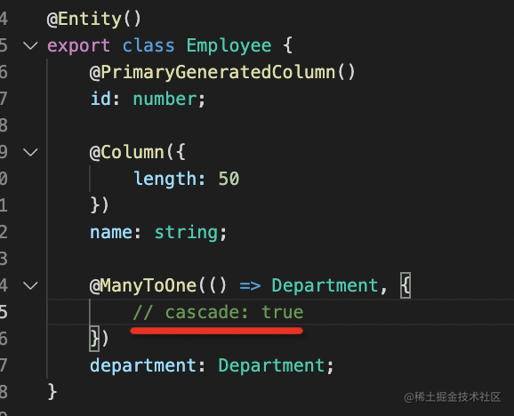

不然，双方都级联保存，那不就无限循环了么？

然后修改下 index.ts

```javascript
import { Department } from './entity/Department';
import { Employee } from './entity/Employee';
import { AppDataSource } from "./data-source"

AppDataSource.initialize().then(async () => {
    const e1 = new Employee();
    e1.name = '张三';

    const e2 = new Employee();
    e2.name = '李四';

    const e3 = new Employee();
    e3.name = '王五';

    const d1 = new Department();
    d1.name = '技术部';
    d1.employees = [e1, e2, e3];

    await AppDataSource.manager.save(Department, d1);

}).catch(error => console.log(error))
```

只需要设置 department 的 employees 属性，然后 save 这个 department。

这样关联的 employee 就会自动保存：


然后再来试下查询：

```javascript
const deps = await AppDataSource.manager.find(Department);
console.log(deps);
```


想要关联查询需要声明下 relations：

```javascript
const deps = await AppDataSource.manager.find(Department, {
    relations: {
        employees: true
    }
});
console.log(deps);
console.log(deps.map(item => item.employees))
```

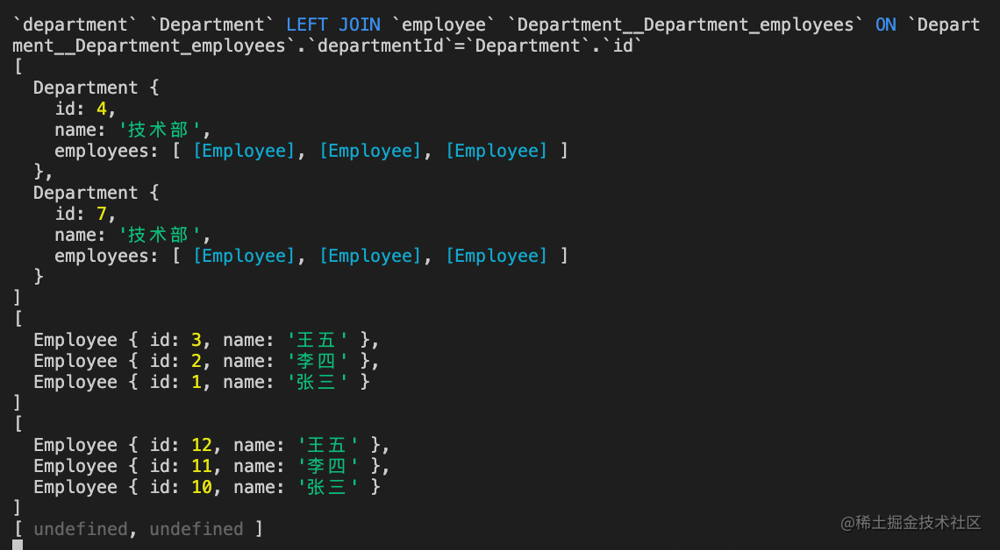

这个 relations 其实就是 left join on，或者通过 query builder 来手动关联：

```javascript
const es = await AppDataSource.manager.getRepository(Department)
            .createQueryBuilder('d')
            .leftJoinAndSelect('d.employees', 'e')
            .getMany();

console.log(es);
console.log(es.map(item => item.employees))
```


先 getRepository 再创建 query builder。

也可以直接用 EntityManager 来创建 query builder：
```javascript
const es = await AppDataSource.manager
    .createQueryBuilder(Department, 'd')
    .leftJoinAndSelect('d.employees', 'e')
    .getMany();

console.log(es);
console.log(es.map(item => item.employees))
```
删除的话，需要先把关联的 employee 删了，再删除 department：

```javascript
const deps = await AppDataSource.manager.find(Department, {
    relations: {
        employees: true
    }
});
await AppDataSource.manager.delete(Employee, deps[0].employees);
await AppDataSource.manager.delete(Department, deps[0].id);
```

当然，如果你设置了 onDelete 为 SET NULL 或者 CASCADE：


那就不用自己删 employee 了，只要删了 department，mysql 会自动把关联的 employee 记录删除，或者是把它们的外键 id 置为空。


案例代码在[小册仓库](https://github.com/QuarkGluonPlasma/nestjs-course-code/tree/main/typeorm-relation-mapping2)。

## 总结

这节我们学了一对多关系的映射，通过 @ManyToOne 或者 @OneToMany 装饰器。

TypeORM 会自动在多的那一方添加外键，不需要通过 @JoinColumn 指定，不过你可以通过 @JoinColumn 来修改外键列的名字。

双方只能有一方 cascade，不然会无限循环。设置了 cascade 之后，只要一方保存，关联的另一方就会自动保存。

删除的话，如果设置了外键的 CASCADE 或者 SET NULL，那只删除主表（一的那一方）对应的 Entity 就好了，msyql 会做后续的关联删除或者 id 置空。

否则就要先删除所有的从表（多的那一方）对应的 Entity 再删除主表对应的 Entity。

这就是 typeorm 的一对多关系的映射和 CRUD。
