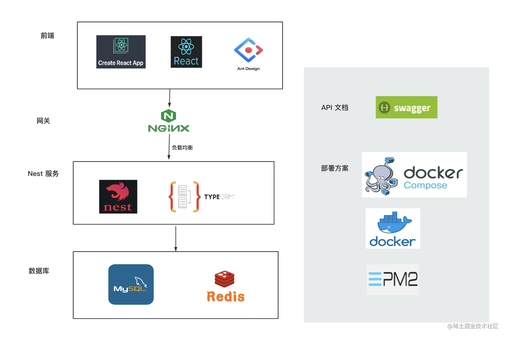
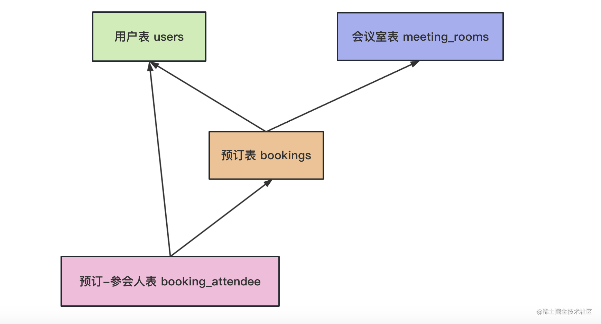
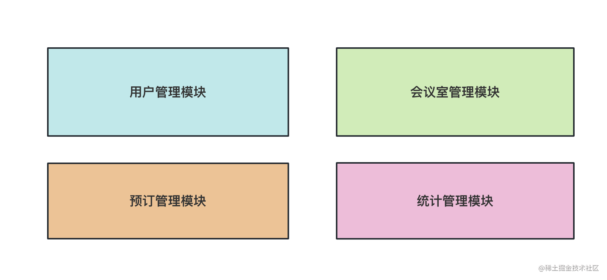
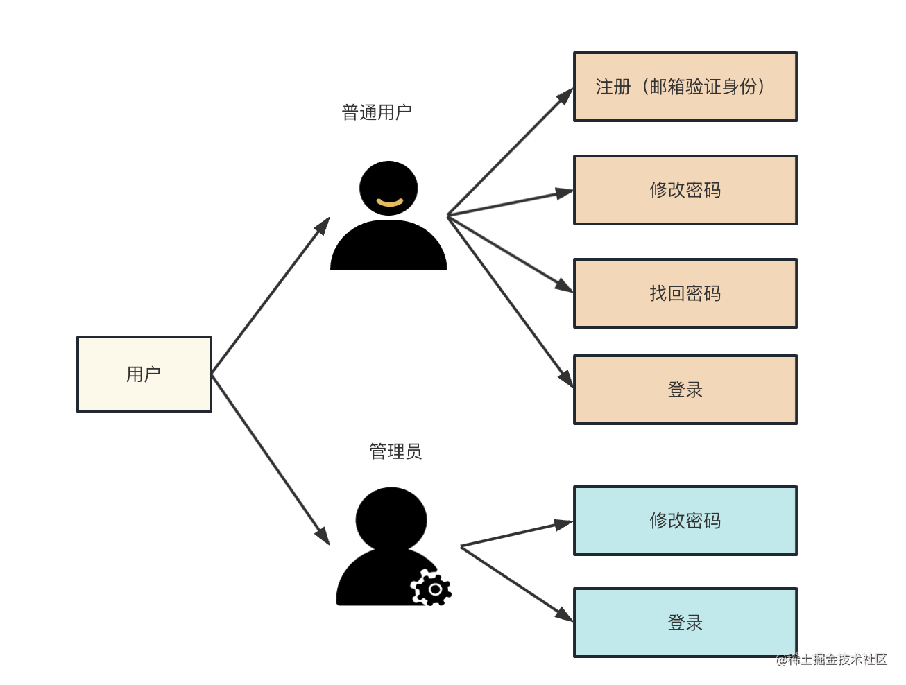
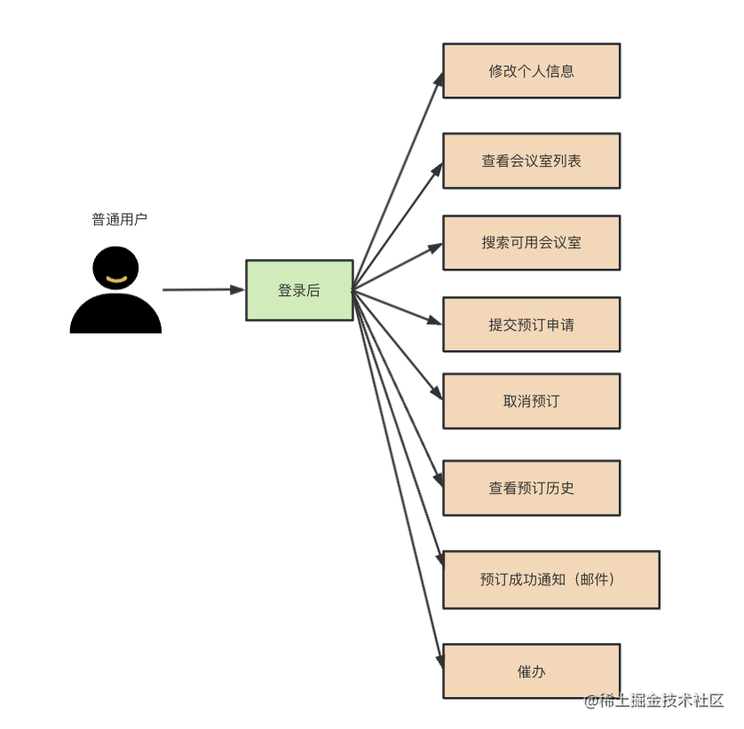
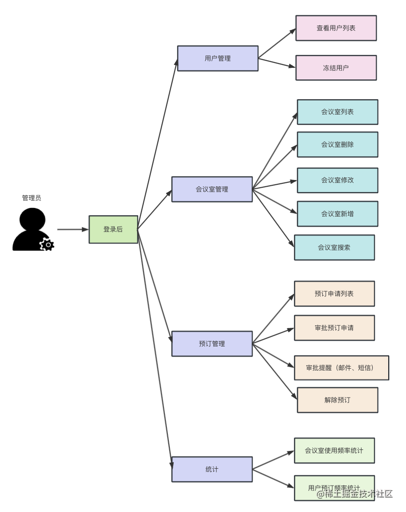

上节我们梳理了有哪些需求，并且画了原型图，明确了要做什么。

这节我们来过一下技术方案，设计下数据库，也就是怎么做。

## 技术栈

我们要做的是一个全栈项目，前端用 React + AntD （或者可以换成其他前端框架），后端用 Nest。

技术栈如下：

前端使用 create-react-app 脚手架创建项目，使用 react + antd 开发页面。

使用 nginx 来网关层，实现静态资源的托管，并且对于动态资源请求做负载均衡。

使用 Nest 开发后端业务逻辑，使用 TypeORM + mysql 来做 CRUD。

使用 Redis 来做缓存，减轻数据库的压力，提高响应性能。

api 文档使用 Swagger 来生成。

部署使用 Docker Compose 的方式。

PM2 可用可不用，不用 PM2 就要启动容器的时候指定重启策略了，这里为了简单我们还是用 PM2。

都是前面讲过的技术，这里只是综合运用。

然后来设计下数据库：

## 数据库设计

首先是用户表 users：

| 字段名 | 数据类型 | 描述 |
| --- | --- | --- |
| id | INT | 用户ID |
| username | VARCHAR(50) |用户名 |
| password | VARCHAR(50) |密码 |
| nick_name | VARCHAR(50) |昵称 |
| email | VARCHAR(50) | 邮箱 |
| head_pic| VARCHAR(100) | 头像 |
| phone_number| VARCHAR(20) | 手机号 |
| is_frozen| BOOLEAN | 是否被冻结 |
| is_admin| BOOLEAN | 是否是管理员 |
| create_time | DATETIME | 创建时间 |
| update_time | DATETIME | 更新时间 |

用户需要区分普通用户和管理员，所以加了个 is_admin 字段。

然后是会议室表 meeting_rooms：

| 字段名 | 数据类型 | 描述 |
| --- | --- | --- |
| id | INT | 会议室ID |
| name | VARCHAR(50) |会议室名字 |
| capacity | INT |会议室容量 |
| location | VARCHAR(50) |会议室位置 |
| equipment | VARCHAR(50) | 设备 |
| description | VARCHAR(100) | 描述 |
| is_booked | BOOLEAN | 是否被预订 |
| create_time | DATETIME | 创建时间 |
| update_time | DATETIME | 更新时间 |

接下来是预订表 bookings：

| 字段名 | 数据类型 | 描述 |
| --- | --- | --- |
| id | INT | 预订ID |
| user_id | INT |预订用户ID |
| room_id | INT |会议室ID |
| start_time | DATETIME | 会议开始时间 |
| end_time | DATETIME | 会议结束时间 |
| status | VARCHAR(20) | 状态（申请中、审批通过、审批驳回、已解除） |
| note | VARCHAR(100) | 备注 |
| create_time | DATETIME | 创建时间 |
| update_time | DATETIME | 更新时间 |
 
然后是预订-参会人表 booking_attendees：

| 字段名 | 数据类型 | 描述 |
| --- | --- | --- |
| id | INT |  ID |
| user_id | INT |参会用户ID |
| booking_id | INT |预订ID |

这几个表的关系如下：

再加上角色表、权限表，还有 2 个中间表：

角色表 roles

| 字段名 | 数据类型 | 描述 |
| --- | --- | --- |
| id | INT |  ID |
| name | VARCHAR(20) | 角色名 |

权限表 permissions

| 字段名 | 数据类型 | 描述 |
| --- | --- | --- |
| id | INT |  ID |
| code | VARCHAR(20) | 权限代码 |
| description | VARCHAR(100) | 权限描述 |

用户-角色中间表 user_roles

| 字段名 | 数据类型 | 描述 |
| --- | --- | --- |
| id | INT |  ID |
| user_id | INT | 用户 ID |
| role_id | INT | 角色 ID |

角色-权限中间表 role_permissions

| 字段名 | 数据类型 | 描述 |
| --- | --- | --- |
| id | INT |  ID |
| role_id | INT | 角色 ID |
| permission_id | INT | 权限 ID |

设计完数据库，我们再来划分下模块：

## 模块划分

首先是用户模块，实现普通用户和管理员的登录、注册、信息修改的功能：

大概有这些接口：

| 接口路径 | 请求方式 | 描述 |
| -- |-- |-- |
| /user/login | POST | 普通用户登录 |
| /user/register | POST | 普通用户注册 |
| /user/update | POST | 普通用户个人信息修改|
| /user/update_password | POST |普通用户修改密码|
| /user/admin/login | POST | 管理员登录|
| /user/admin/update_password| POST |管理员修改密码|
| /user/admin/update | POST | 管理员个人信息修改|
| /user/list | GET |用户列表|
| /user/freeze | GET | 冻结用户|

然后是会议室管理模块：

| 接口路径 | 请求方式 | 描述 |
| -- | -- | -- |
| /meeting_room/list | GET | 会议室列表 |
| /meeting_room/delete/:id | DELETE | 会议室删除 |
| /meeting_room/update/:id | PUT |会议室更新|
| /meeting_room/create | POST |会议室新增|
| /meeting_room/search | GET |会议室搜索|

然后是预订管理模块：

| 接口路径 | 请求方式 | 描述 |
| -- | -- | -- |
| /booking/list | GET | 预订列表 |
| /booking/approve | POST| 审批预订申请 |
| /booking/add | POST |申请预订|
| /booking/apply/:id | GET |通过预订|
| /booking/reject/:id | GET |取消预订|
| /booking/unbind/:id | GET |解除预订|
| /booking/history | GET|预订历史 |
| /booking/urge | GET |催办 |

然后是统计模块：

| 接口路径 | 请求方式 | 描述 |
| -- | -- | -- |
| /statistics/meeting_room_usage_frequency | GET |  会议室使用频率统计 |
| /statistics/user_booking_frequency | GET | 用户预订频率统计 |

## 角色划分

权限控制使用 RBAC 的方式，有普通用户和管理员两个角色，

两个角色各自可以操作的接口就是上节用例图画的那些：

## 总结

这节我们设计了下技术方案。

技术栈：前端是 antd + react + cra，后端是 nest + typeorm，数据库是 mysql + redis，API 文档用 swagger 生成，部署用 docker compose + pm2，网关使用 nginx。

数据库表有 8 个：用户表 users、会议室表 meeting_rooms、预订表 bookings、预订-参会者表 booking_attendees、角色表 roles、权限表 permissions、用户-角色表 user_roles、角色-权限表 role_permissions。

模块有 4 个：用户管理模块、会议室管理模块、预订管理模块、统计管理模块。

角色有两个：普通用户、管理员，各自拥有的权限按照用例图来。使用 RBAC 来控制接口访问权限。

技术方案确定之后，下节开始我们就正式进入开发了。
