后端接口写完了，这节我们来实现下前端页面。

先写管理端的：


把管理端项目跑起来：

```
npm run start
```


我们已经添加了对应的路由，但是还没做点击菜单时的切换。

加一下：

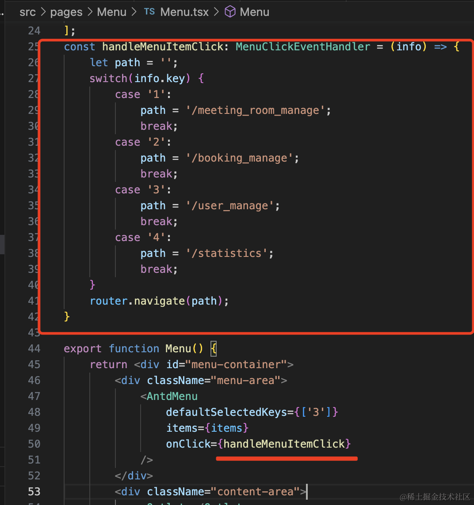
```javascript
const handleMenuItemClick: MenuClickEventHandler = (info) => {
    let path = '';
    switch(info.key) {
        case '1':
            path = '/meeting_room_manage';
            break;
        case '2':
            path = '/booking_manage';
            break;    
        case '3':
            path = '/user_manage';
            break;
        case '4':
            path = '/statistics';
            break;                    
    }
    router.navigate(path);
}

```
然后写下这 3 个路由的组件：

src/pages/MeetingRoomManage/MeetingRoomManage.tsx
```javascript
export function MeetingRoomManage() {
    return <div>MeetingRoomManage</div>
}
```
src/pages/BookingManage/BookingManage.tsx
```javascript
export function BookingManage() {
    return <div>BookingManage</div>
}
```
src/pages/Statistics/Statistics.tsx
```javascript
export function Statistics() {
    return <div>Statistics</div>
}
```
注册这三个组件对应的路由：

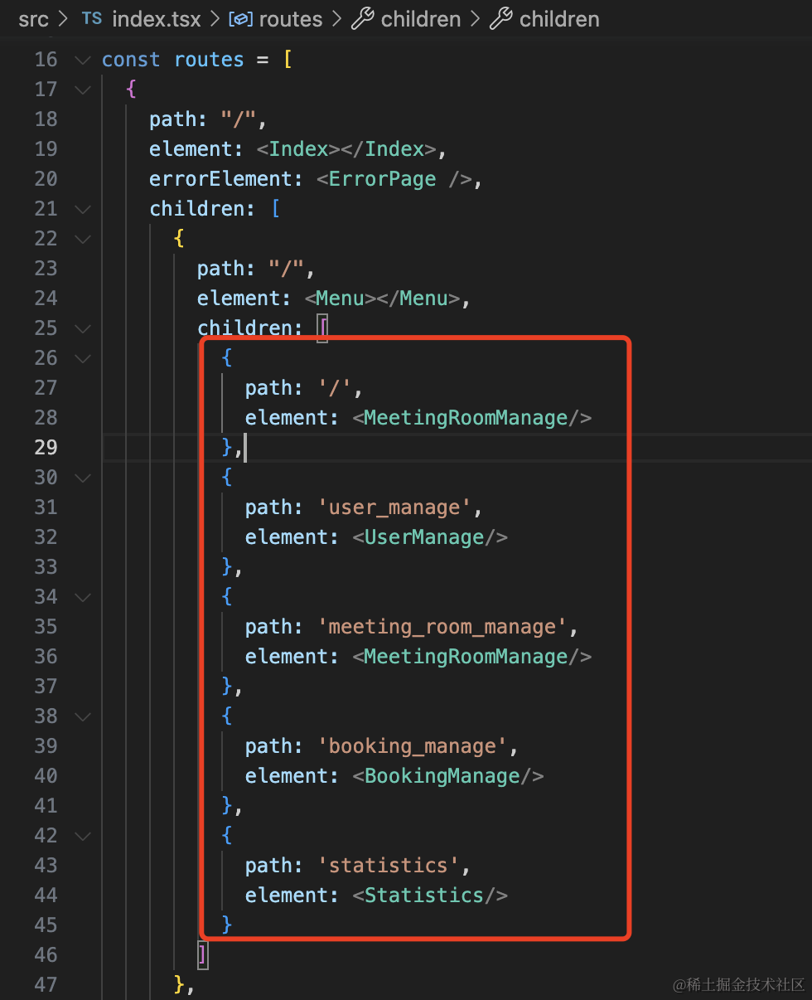

```javascript
{
    path: '/',
    element: <MeetingRoomManage/>
},
{
    path: 'user_manage',
    element: <UserManage/>
},
{
    path: 'meeting_room_manage',
    element: <MeetingRoomManage/>
},
{
    path: 'booking_manage',
    element: <BookingManage/>
},
{
    path: 'statistics',
    element: <Statistics/>
}
```
测试下：

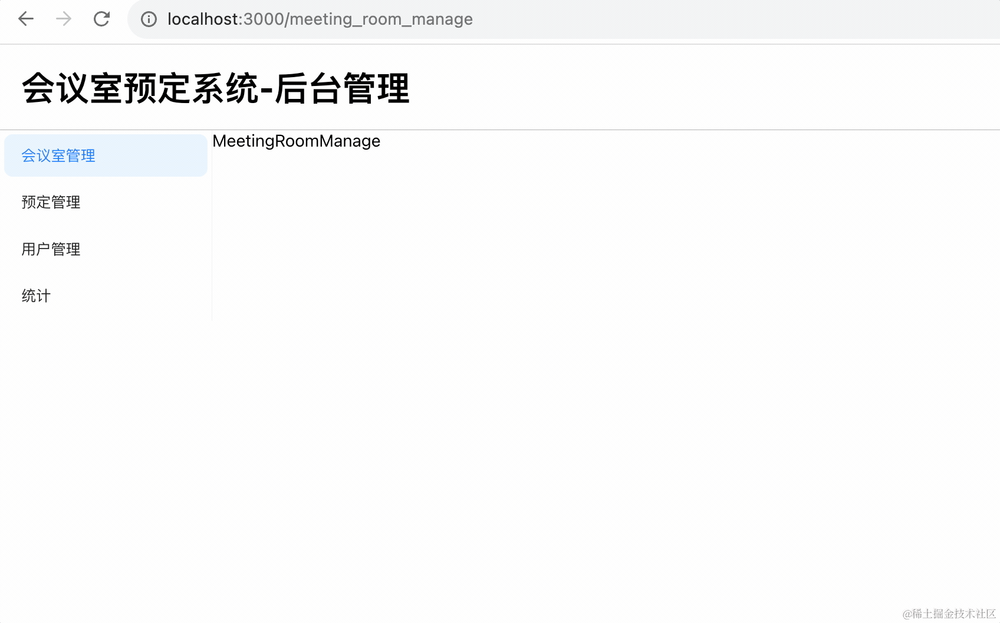

然后还要加上页面刷新时选中对应菜单项的逻辑：

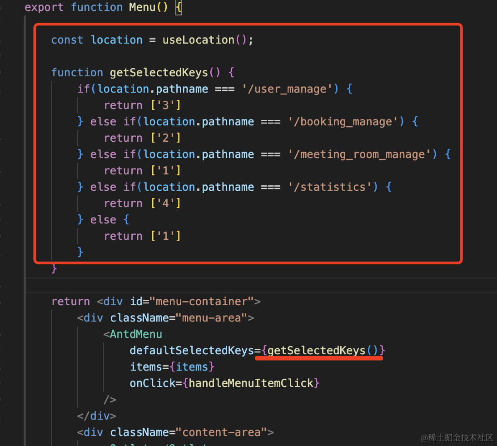

```javascript
const location = useLocation();

function getSelectedKeys() {
    if(location.pathname === '/user_manage') {
        return ['3']
    } else if(location.pathname === '/booking_manage') {
        return ['2']
    } else if(location.pathname === '/meeting_room_manage') {
        return ['1']
    } else if(location.pathname === '/statistics') {
        return ['4']
    } else {
        return ['1']
    }
}
```
这样，刷新后也会选中对应的菜单项：


然后来实现会议室管理页面：


和我们前面写过的用户列表差不多：

```javascript
import { Badge, Button, Form, Image, Input, Table, message } from "antd";
import { useCallback, useEffect, useMemo, useState } from "react";
import './meeting_room_manage.css';
import { ColumnsType } from "antd/es/table";
import { useForm } from "antd/es/form/Form";

interface SearchMeetingRoom {
    name: string;
    capacity: number;
    equipment: string;
}

interface MeetingRoomSearchResult {
    id: number,
    name: string;
    capacity: number;
    location: string;
    equipment: string;
    description: string;
    isBooked: boolean;
    createTime: Date;
    updateTime: Date;
}


export function MeetingRoomManage() {
    const [pageNo, setPageNo] = useState<number>(1);
    const [pageSize, setPageSize] = useState<number>(10);
    const [meetingRoomResult, setMeetingRoomResult] = useState<Array<MeetingRoomSearchResult>>([]);

    const columns: ColumnsType<MeetingRoomSearchResult> = useMemo(() => [
        {
            title: '名称',
            dataIndex: 'name'
        },
        {
            title: '容纳人数',
            dataIndex: 'capacity',
        },
        {
            title: '位置',
            dataIndex: 'location'
        },
        {
            title: '设备',
            dataIndex: 'equipment'
        },
        {
            title: '描述',
            dataIndex: 'description'
        },
        {
            title: '添加时间',
            dataIndex: 'createTime'
        },
        {
            title: '上次更新时间',
            dataIndex: 'updateTime'
        },
        {
            title: '预定状态',
            dataIndex: 'isBooked',
            render: (_, record) => (
                record.isBooked ? <Badge status="error">已被预订</Badge> : <Badge status="success">可预定</Badge>
            )
        },
        {
            title: '操作',
            render: (_, record) => (
                <a href="#" onClick={() => {}}>删除</a>
            )
        }
    ], []);

    const searchMeetingRoom = useCallback(async (values: SearchMeetingRoom) => {
        
    }, []);

    const [form ]  = useForm();

    const changePage = useCallback(function(pageNo: number, pageSize: number) {
        setPageNo(pageNo);
        setPageSize(pageSize);
    }, []);


    return <div id="meetingRoomManage-container">
        <div className="meetingRoomManage-form">
            <Form
                form={form}
                onFinish={searchMeetingRoom}
                name="search"
                layout='inline'
                colon={false}
            >
                <Form.Item label="会议室名称" name="name">
                    <Input />
                </Form.Item>

                <Form.Item label="容纳人数" name="capacity">
                    <Input />
                </Form.Item>

                <Form.Item label="位置" name="location">
                    <Input/>
                </Form.Item>

                <Form.Item label=" ">
                    <Button type="primary" htmlType="submit">
                        搜索会议室
                    </Button>
                    <Button type="primary" style={{background: 'green'}}>
                        添加会议室
                    </Button>

                </Form.Item>
            </Form>
        </div>
        <div className="meetingRoomManage-table">
            <Table columns={columns} dataSource={meetingRoomResult} pagination={ {
                current: pageNo,
                pageSize: pageSize,
                onChange: changePage
            }}/>
        </div>
    </div>
}
```
css 部分如下：

```css
#meetingRoomManage-container {
    padding: 20px;
}
#meetingRoomManage-container .meetingRoomManage-form {
    margin-bottom: 40px;
}
```
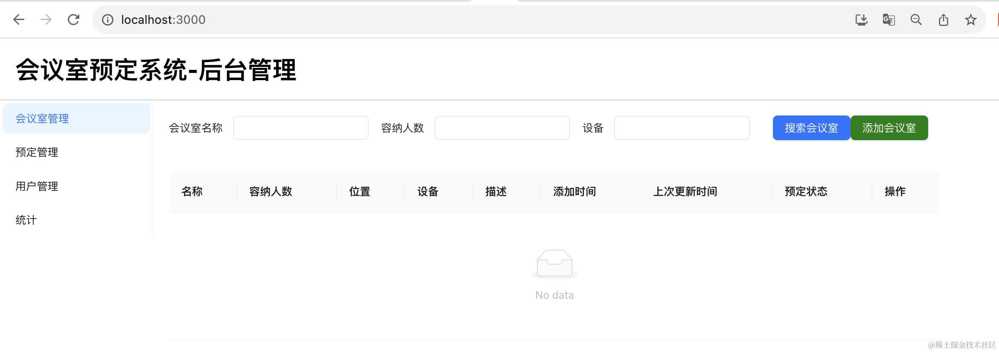

然后我们在 interfaces.ts 添加 list 接口：

```javascript
export async function meetingRoomList(name: string, capacity: number, equipment: string, pageNo: number, pageSize: number) {
    return await axiosInstance.get('/meeting-room/list', {
        params: {
            name,
            capacity,
            equipment,
            pageNo,
            pageSize
        }
    });
}
```
在页面调用下：

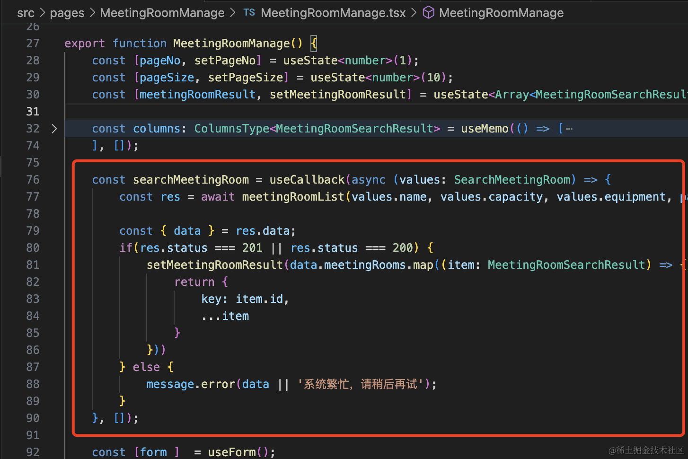

```javascript
const searchMeetingRoom = useCallback(async (values: SearchMeetingRoom) => {
    const res = await meetingRoomList(values.name, values.capacity, values.equipment, pageNo, pageSize);

    const { data } = res.data;
    if(res.status === 201 || res.status === 200) {
        setMeetingRoomResult(data.meetingRooms.map((item: MeetingRoomSearchResult) => {
            return {
                key: item.id,
                ...item
            }
        }))
    } else {
        message.error(data || '系统繁忙，请稍后再试');
    }
}, []);
```

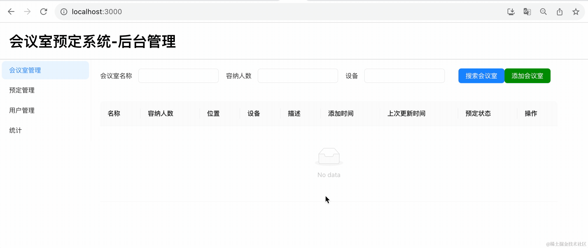

按名称搜索：

按容量搜索：

按设备搜索：
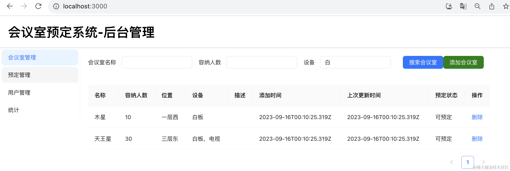

然后，最开始进入页面的时候也得搜索一次：


```javascript
useEffect(() => {
    searchMeetingRoom({
        name: form.getFieldValue('name'),
        capacity: form.getFieldValue('capacity'),
        equipment: form.getFieldValue('equipment')
    });
}, [pageNo, pageSize]);
```
最开始搜索一次，并且分页信息变了也重新搜索。

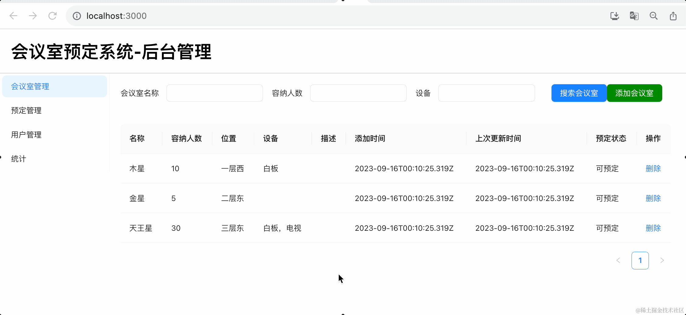

这样，刚进入页面就会触发一次搜索。

然后我们处理删除：

在 interfaces.ts 里添加 delete 接口：

```javascript
export async function deleteMeetingRoom(id: number) {
    return await axiosInstance.delete('/meeting-room/' + id);
}
```

然后添加删除按钮的处理逻辑：

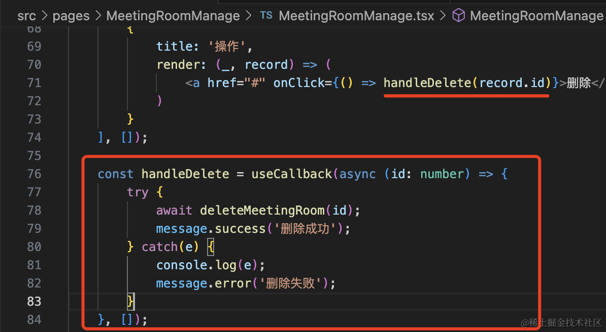

```javascript
<a href="#" onClick={() => handleDelete(record.id)}>删除</a>
```
```javascript
const handleDelete = useCallback(async (id: number) => {
    try {
        await deleteMeetingRoom(id);
        message.success('删除成功');
    } catch(e) {
        console.log(e);
        message.error('删除失败');
    }
}, []);
```


提示删除成功，刷新后也确实没有了。

不过应该是删除后自动刷新的。

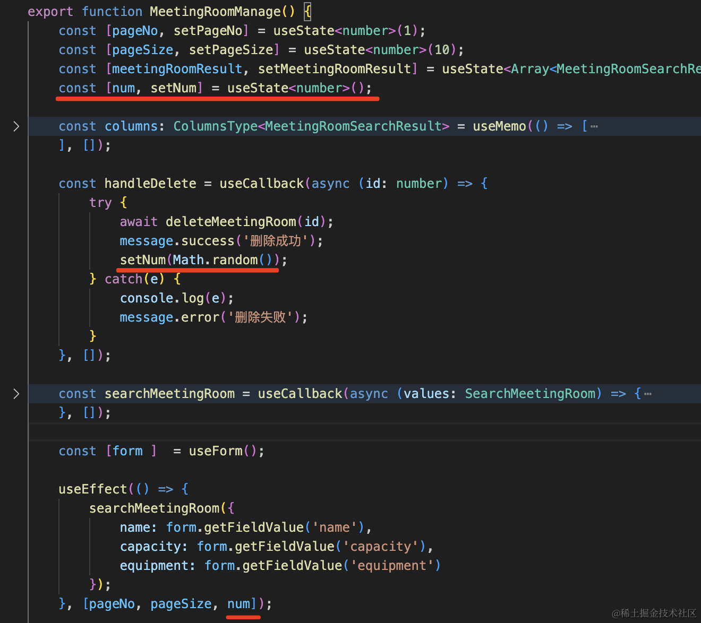

我们添加一个状态，删除后设置一个随机数，然后把它作为 useEffect 的依赖，这样就能触发重新搜索。

```javascript
const [num, setNum] = useState<number>();
```

```javascript
setNum(Math.random());
```

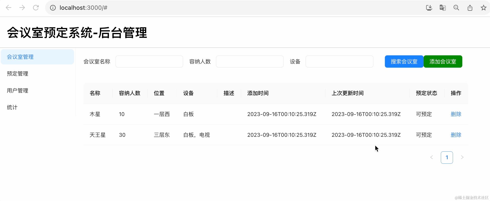

不过，删除操作最好加上个二次确认。

这个把按钮抱一下就好了：

```javascript
{
    title: '操作',
    render: (_, record) => (
        <Popconfirm
            title="会议室删除"
            description="确认删除吗？"
            onConfirm={() => handleDelete(record.id)}
            okText="Yes"
            cancelText="No"
        >  
            <a href="#">删除</a>
        </Popconfirm>
    )
}
```

这样，点击后就会出现一个确认框，确认后才会删除：

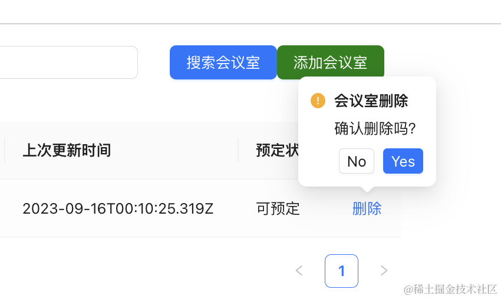

然后实现添加会议室：


我们在 MeetingRoomManage 的同级添加一个 CreateMeetingRoomModal 组件：

```javascript
import { Modal } from "antd";
import { useCallback } from "react";

interface CreateMeetingRoomModalProps {
    isOpen: boolean;
    handleClose: Function
}

export function CreateMeetingRoomModal(props: CreateMeetingRoomModalProps) {

    const handleOk = useCallback(async function() {
        props.handleClose();
    }, []);

    return <Modal title="创建会议室" open={props.isOpen} onOk={handleOk} onCancel={() => props.handleClose()}>
        <p>xxxx</p>
    </Modal>
}
```
组件里有一个 Modal，通过参数 isOpen 控制是否显示。

当点击取消的时候，或者确认的时候，都会调用 props.handleClose 方法。

然后在 MeetingRoomManage 引入它：

先添加一个状态代表 modal 是否打开：


```javascript
const [isCreateModalOpen, setIsCreateModalOpen] = useState(false);
```

然后添加 Modal 组件，并且点击按钮的时候 open：

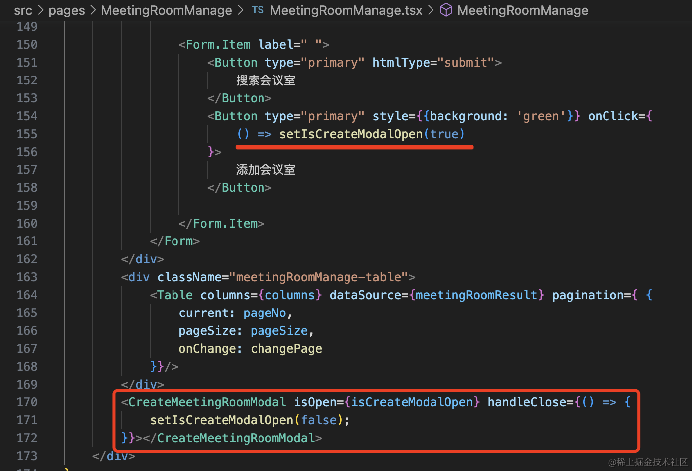

```javascript
<Button type="primary" style={{background: 'green'}} onClick={
    () => setIsCreateModalOpen(true)
}>
    添加会议室
</Button>

```

```javascript
<CreateMeetingRoomModal isOpen={isCreateModalOpen} handleClose={() => {
    setIsCreateModalOpen(false);
}}></CreateMeetingRoomModal>
```

这样，modal 就添加成功了：


然后实现 modal 的具体逻辑，创建会议室：

```javascript
import { Button, Form, Input,InputNumber, Modal } from "antd";
import { useForm } from "antd/es/form/Form";
import TextArea from "antd/es/input/TextArea";
import { useCallback } from "react";

interface CreateMeetingRoomModalProps {
    isOpen: boolean;
    handleClose: Function
}
const layout = {
    labelCol: { span: 6 },
    wrapperCol: { span: 18 }
}
export interface CreateMeetingRoom {
    name: string;
    capacity: number;
    location: string;
    equipment: string;
    description: string;
}

export function CreateMeetingRoomModal(props: CreateMeetingRoomModalProps) {

    const [form] = useForm();

    const handleOk = useCallback(async function() {
        const values = form.getFieldsValue();
        console.log(values);

        props.handleClose();
    }, []);

    return <Modal title="创建会议室" open={props.isOpen} onOk={handleOk} onCancel={() => props.handleClose()} okText={'创建'}>
        <Form
            form={form}
            colon={false}
            {...layout}
        >
            <Form.Item
                label="会议室名称"
                name="name"
                rules={[
                    { required: true, message: '请输入会议室名称!' },
                ]}
            >
                <Input />
            </Form.Item>
            <Form.Item
                label="位置"
                name="location"
                rules={[
                    { required: true, message: '请输入会议室位置!' },
                ]}
            >
                <Input />
            </Form.Item>
            <Form.Item
                label="容纳人数"
                name="capacity"
                rules={[
                    { required: true, message: '请输入会议室容量!' },
                ]}
            >
                <InputNumber />
            </Form.Item>
            <Form.Item
                label="设备"
                name="equipment"
            >
                <Input />
            </Form.Item>
            <Form.Item
                label="描述"
                name="description"
            >
                <TextArea />
            </Form.Item>
        </Form>
    </Modal>
}
```
在 modal 里添加一个表单，点击创建按钮的时候打印表单值。

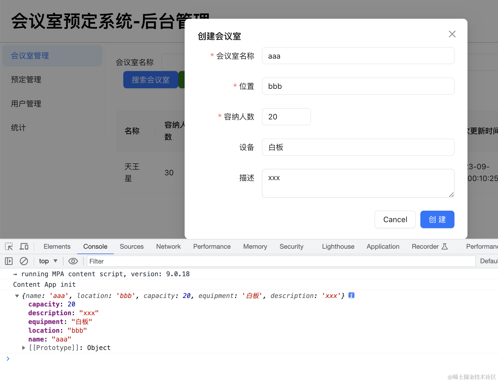

我们在 interfaces.ts 添加创建会议室的接口：

```javascript
export async function createMeetingRoom(meetingRoom: CreateMeetingRoom) {
    return await axiosInstance.post('/meeting-room/create', meetingRoom);
}
```
在组件里调用下：


```javascript
const [form] = useForm<CreateMeetingRoom>();

const handleOk = useCallback(async function() {
    const values = form.getFieldsValue();

    values.description = values.description || '';
    values.equipment = values.equipment || '';

    const res = await createMeetingRoom(values);

    if(res.status === 201 || res.status === 200) {
        message.success('创建成功');
        form.resetFields();
        props.handleClose();
    } else {
        message.error(res.data.data);
    }
}, []);
```
如果没有填 description 或者 equipment 就设置个空字符串。

测试下：

创建失败时：


创建成功时：


创建成功后，手动刷新页面，就看到了新的会议室。

然后我们在关掉弹窗的时候设置下 num。

这样就会触发列表数据的刷新：


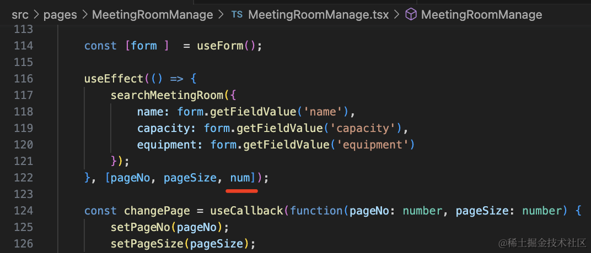

测试下：

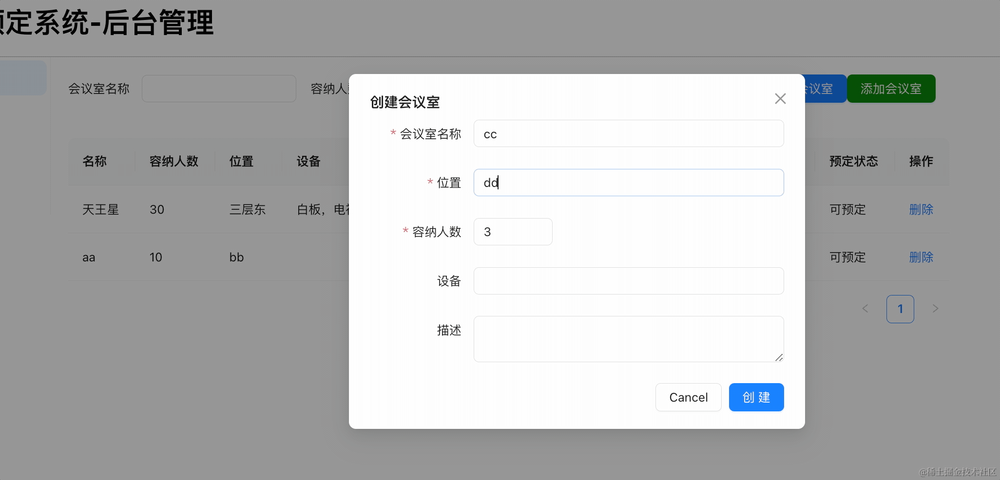

最后，加上更新会议室的功能：

创建 UpdateMeetingRoom.tsx

内容和 create 的基本一样：

```javascript
import { Button, Form, Input, InputNumber, Modal, message } from "antd";
import { useForm } from "antd/es/form/Form";
import TextArea from "antd/es/input/TextArea";
import { useCallback } from "react";
import { updateMeetingRoom } from "../../interfaces/interfaces";

interface UpdateMeetingRoomModalProps {
    isOpen: boolean;
    handleClose: Function
}
const layout = {
    labelCol: { span: 6 },
    wrapperCol: { span: 18 }
}

export interface UpdateMeetingRoom {
    name: string;
    capacity: number;
    location: string;
    equipment: string;
    description: string;
}

export function UpdateMeetingRoomModal(props: UpdateMeetingRoomModalProps) {

    const [form] = useForm<UpdateMeetingRoom>();

    const handleOk = useCallback(async function() {
        props.handleClose();
    }, []);

    return <Modal title="更新会议室" open={props.isOpen} onOk={handleOk} onCancel={() => props.handleClose()} okText={'更新'}>
        <Form
            form={form}
            colon={false}
            {...layout}
        >
            <Form.Item
                label="会议室名称"
                name="name"
                rules={[
                    { required: true, message: '请输入会议室名称!' },
                ]}
            >
                <Input />
            </Form.Item>
            <Form.Item
                label="位置"
                name="location"
                rules={[
                    { required: true, message: '请输入会议室位置!' },
                ]}
            >
                <Input />
            </Form.Item>
            <Form.Item
                label="容纳人数"
                name="capacity"
                rules={[
                    { required: true, message: '请输入会议室容量!' },
                ]}
            >
                <InputNumber />
            </Form.Item>
            <Form.Item
                label="设备"
                name="equipment"
            >
                <Input />
            </Form.Item>
            <Form.Item
                label="描述"
                name="description"
            >
                <TextArea/>
            </Form.Item>
        </Form>
    </Modal>
}
```

在 interfaces.ts里创建会用到的接口：

```javascript
export async function updateMeetingRoom(meetingRoom: UpdateMeetingRoom) {
    return await axiosInstance.put('/meeting-room/update', meetingRoom);
}

export async function findMeetingRoom(id: number) {
    return await axiosInstance.get('/meeting-room/' + id);
}
```
然后在 MeetingRoomManage 组件引入：

先创建两个 state：


```javascript
const [isUpdateModalOpen, setIsUpdateModalOpen] = useState(false);
const [updateId, setUpdateId] = useState<number>();
```
一个是 update 弹窗是否打开，一个是当前的 id。

然后添加一个更新按钮，点击的时候打开弹出弹窗，设置 id：

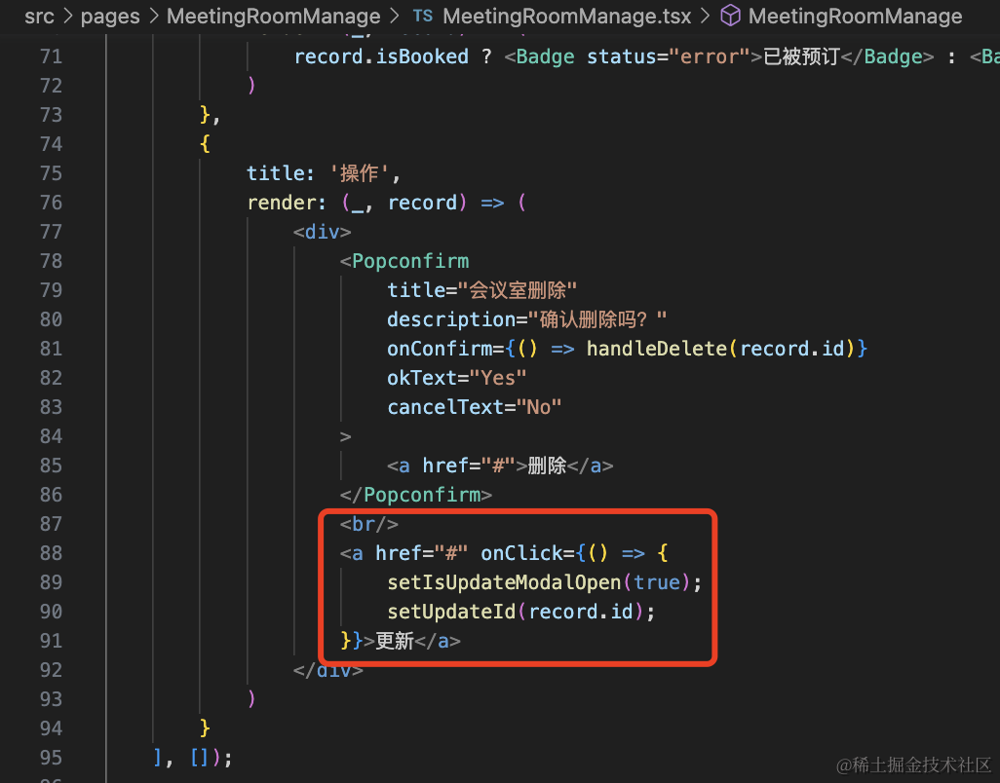

```javascript
{
    title: '操作',
    render: (_, record) => (
        <div>
            <Popconfirm
                title="会议室删除"
                description="确认删除吗？"
                onConfirm={() => handleDelete(record.id)}
                okText="Yes"
                cancelText="No"
            >  
                <a href="#">删除</a>
            </Popconfirm>
            <br/>
            <a href="#" onClick={() => {
                setIsUpdateModalOpen(true);
                setUpdateId(record.id);
            }}>更新</a>
        </div>
    )
}
```

在下面加上弹窗：


```javascript
<UpdateMeetingRoomModal isOpen={isUpdateModalOpen} handleClose={() => {
    setIsUpdateModalOpen(false);
    setNum(Math.random());
}}></UpdateMeetingRoomModal>
```
这样更新弹窗就加上了：


然后我们要把 id 传过去：


updateId 的默认值是 undefined，可能为空，加上 ! 代表非空。

然后在组件里添加这个参数：


并且调用查询接口，查询 id 对应的数据来回显：

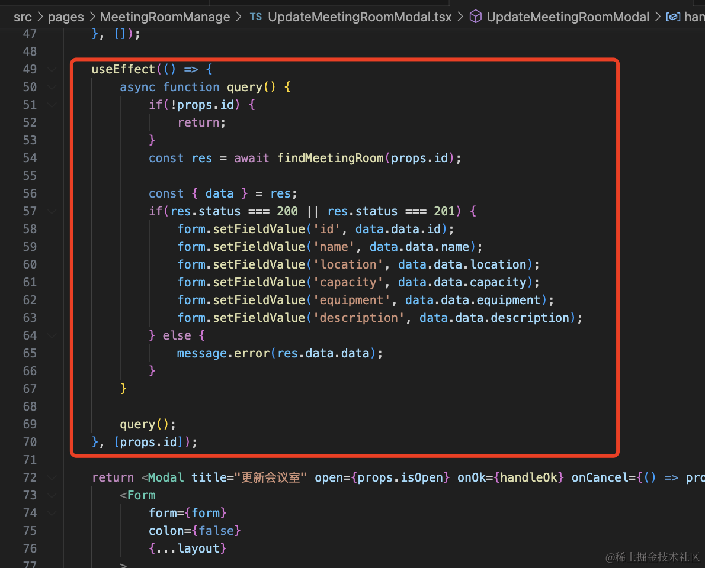

```javascript
useEffect(() => {
    async function query() {
        if(!props.id) {
            return;
        }
        const res = await findMeetingRoom(props.id);

        const { data } = res;
        if(res.status === 200 || res.status === 201) {
            form.setFieldValue('id', data.data.id);
            form.setFieldValue('name', data.data.name);
            form.setFieldValue('location', data.data.location);
            form.setFieldValue('capacity', data.data.capacity);
            form.setFieldValue('equipment', data.data.equipment);
            form.setFieldValue('description', data.data.description);
        } else {
            message.error(res.data.data);
        }
    }

    query();
}, [props.id]);
```
现在就能回显数据了：


然后再加上更新数据的接口：

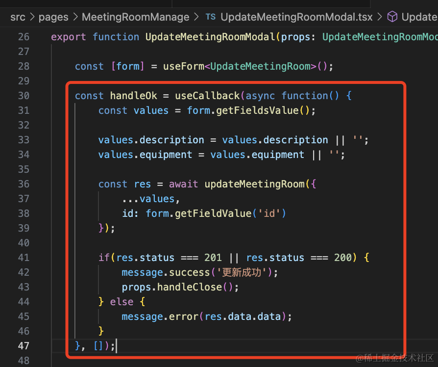

```javascript
const handleOk = useCallback(async function() {
    const values = form.getFieldsValue();

    values.description = values.description || '';
    values.equipment = values.equipment || '';

    const res = await updateMeetingRoom({
        ...values,
        id: form.getFieldValue('id')
    });

    if(res.status === 201 || res.status === 200) {
        message.success('更新成功');
        props.handleClose();
    } else {
        message.error(res.data.data);
    }
}, []);
```
这里要的参数要额外带上 id。

测试下：


更新成功了。

这样，会议室管理的页面就完成了。

案例代码上传了[小册仓库](https://github.com/QuarkGluonPlasma/nestjs-course-code/tree/main/meeting_room_booking_system_frontend_admin)。

## 总结

这节我们实现了会议室管理的前端页面。

实现了列表、分页和搜索，添加会议室、更新会议室、删除会议室。

其中添加和更新会议室需要创建 Modal，我们把它拆分成了单独的组件。

更新会议室的时候，传入 id，根据 id 回显数据，然后修改完以后再更新数据。

至此，会议室管理的后端和前端代码就都完成了。
